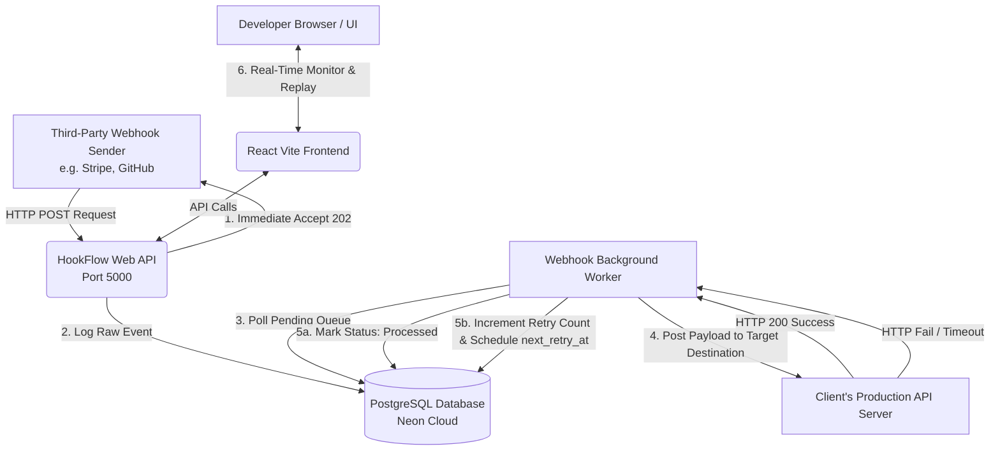
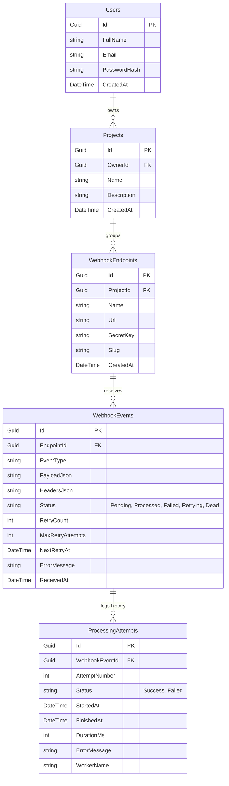

# ⚡ HookFlow

<div align="center">

[](https://github.com/phanhoaian1203/hookflow/actions/workflows/backend-ci.yml)
[](https://github.com/phanhoaian1203/hookflow/actions/workflows/frontend-ci.yml)
[](https://dotnet.microsoft.com/)
[](https://react.dev/)
[](https://www.docker.com/)
[](LICENSE)

**A Premium, High-Performance Webhook Gateway & Intelligent Retry Queue System.**  
*Empowering developers to monitor, retry, replay, and analyze third-party webhook deliveries in real-time.*

[Explore Docs](docs/PROJECT_OVERVIEW.md) · [View API Docs](docs/API_DOCUMENTATION.md) · [Report Bug](https://github.com/phanhoaian1203/hookflow/issues)

</div>

---

## 📖 Project Introduction

In modern microservices and SaaS architectures, **webhooks** are the glue connecting external APIs (like Stripe, GitHub, Twilio) to internal systems. However, webhooks are inherently unreliable due to transient network failures, client-side crashes, or database lockups. If a webhook is missed, data consistency is broken.

**HookFlow** solves this problem by acting as an intelligent, high-availability **Webhook Gateway**. It captures incoming webhook payloads, immediately returns a `202 Accepted` status to the sender to prevent timeouts, and delegates the payload processing to a resilient asynchronous worker. If a delivery attempt fails, HookFlow triggers a custom exponential backoff retry policy, placing failed payloads into a premium monitoring queue for developer inspection, manual replay, or diagnostic analysis.

---

## ⚡ Key Features

* 📊 **Premium Dashboard Analytics:** Real-time data-driven metrics including Total Webhook Volume, processed/failed/retrying statistics, failure rates, average processing duration, and weekly volume bar charts.
* 🔄 **Intelligent Retry Queue:** Automated exponential backoff retry mechanism (1 min, 5 min, 15 min, 1 hr) with strict attempt limit gates (max 5 attempts).
* 🎯 **Manual Replay & Diagnostic Replay:** Developer panel to trigger manual replay of any specific failed event directly from the UI, updating its status back to Pending dynamically.
* 🔒 **Tenant-Isolated Workspaces:** Multi-tenant workspace system allowing users to group endpoints under distinct Projects, enforcing strict boundary-checked data access.
* 🧪 **Payload Simulator:** Fully integrated test payload simulator to generate valid and invalid webhook requests (with signature checks and custom payload headers) to test routing logic instantly.
* 🐳 **Complete Containerization:** Fully dockerized backend API, background worker, database, and caching layers supporting single-command local development.

---

## 🛠️ Technology Stack

| Component | Technology | Description |
| :--- | :--- | :--- |
| **Backend API** | `.NET 10.0 / ASP.NET Core` | High-performance RESTful Web API engineered with Clean Architecture. |
| **Background Worker** | `Host.CreateApplicationBuilder` | Resilient, concurrent background Hosted Service processing the retry queue. |
| **Database ORM** | `Entity Framework Core` | Strongly-typed SQL mapping with automatic PostgreSQL migrations on startup. |
| **Primary Database** | `PostgreSQL` | Secure database storing users, projects, endpoints, and detailed webhook attempts. |
| **Cache & Queue** | `Redis` | Ultra-fast caching and background task scheduling support. |
| **Frontend Framework** | `React 19 / Vite 8` | Modern Single Page Application (SPA) utilizing React TypeScript. |
| **State Management** | `React Query (TanStack)` | Asynchronous server-state synchronization and cache invalidation. |
| **Styling & Icons** | `Tailwind CSS / Lucide` | Elegant, dark-theme dashboard design (Vercel/Stripe aesthetics). |
| **CI/CD** | `GitHub Actions` | Automatically triggers compilation, ESLint, and test checks on every push. |
| **Hosting (Demo)** | `Vercel / Render / Neon` | Distributed free-tier hosting for quick deployment and review. |

---

## 📐 System Architecture

HookFlow uses a highly decoupled architectural layout to guarantee message delivery even when downstream database systems are heavily loaded:



---

## 🗄️ Database Design

The database schema is designed with high integrity and tenant isolation, capturing detailed attempt diagnostic history:



---

## 🐳 Quick Start (Local Docker Setup)

Get the entire fullstack stack (PostgreSQL database, Redis cache, Backend API, Worker, and Frontend React App) running locally with a single command:

1. **Clone the repository:**
   ```bash
   git clone https://github.com/phanhoaian1203/hookflow.git
   cd hookflow
   ```
2. **Launch all services:**
   ```bash
   docker compose up -d --build
   ```
3. **Access applications:**
   * **Frontend UI:** [http://localhost:5173](http://localhost:5173)
   * **Backend API Swagger/Scalar:** [http://localhost:5000/swagger](http://localhost:5000/swagger)

---

## 📦 CI/CD Pipeline & Deployment

HookFlow is integrated with high-quality CI/CD pipelines to guarantee code standard compliance:

### ⚙️ CI Pipeline (GitHub Actions)
- **Backend CI (`backend-ci.yml`):** Automatically restores, compiles, and runs xUnit tests in `HookFlow.Tests` utilizing .NET 10.0 SDK.
- **Frontend CI (`frontend-ci.yml`):** Installs npm packages, executes clean ESLint styling checks (using `--quiet` flag), and packages the bundle into production assets inside `dist/`.

### 🚀 Production Deployment (Phase 1)
The live version of HookFlow is fully deployed using:
- **Frontend:** Hosted on [Vercel](https://vercel.com/) -> [https://hookflow-fawn.vercel.app](https://hookflow-fawn.vercel.app)
- **Backend API:** Hosted on [Render](https://render.com/) -> [https://hookflow-api.onrender.com](https://hookflow-api.onrender.com)
- **Database:** Hosted on [Neon Cloud PostgreSQL](https://neon.tech/)

---

## 👤 Demo Credentials
You can quickly review the application on Vercel using the following pre-created demo account:
* **Email address:** `demo@hookflow.com`
* **Password:** `password123`

---

## 🗺️ Roadmap & Documentation Index

For exhaustive technical information, please explore our dedicated documentation guides inside `docs/`:

1. 📂 **[Project Overview](docs/PROJECT_OVERVIEW.md):** Deep-dive into problem statements, domain terminology, and core value propositions.
2. 📂 **[System Requirements](docs/REQUIREMENTS.md):** Functional & non-functional technical requirement specifications.
3. 📂 **[System Architecture](docs/ARCHITECTURE.md):** Deep architectural decisions (Clean Architecture, background service state synchronization).
4. 📂 **[Database Design](docs/DATABASE_DESIGN.md):** Relational schema details, indexes, data retention, and performance queries.
5. 📂 **[API Documentation](docs/API_DOCUMENTATION.md):** Exhaustive REST endpoints list with example payloads and HTTP statuses.
6. 📂 **[Deployment Guide](docs/DEPLOYMENT.md):** Phase 1 (Neon/Render/Vercel) and Phase 2 (VPS/Docker Compose/Nginx Reverse Proxy) instructions.
7. 📂 **[CI/CD Workflow Config](docs/CI_CD.md):** Detailed pipelines configuration, caches setup, and environment values.
8. 📂 **[QA Verification Checklist](docs/QA_CHECKLIST.md):** System quality-assurance checklist for testing manual, unit, and network failure modes.

---

## 📄 License
This project is licensed under the MIT License - see the [LICENSE](LICENSE) file for details.
